# CONTAPLUS

## 1. Introduction  
### 1.1 Scenario  
A “Company X” needs a web based application to manage accounting tasks such  as:  
- Sales,   
- Purchase,  
- Stock management,  
- Administrative operations.   

A Software Development Company “JOSEPHUM INC” provides such capabilities with a web-based accounting application with yearly subscriptions:   
1. When Company X pays for first month subscription, an ADMIN username and password is provided. 
2.	With the provided credentials ADMIN of Company X can create MANAGER and EMPLOYEE users and Company X can keep the track of accounting processes.  
3.	Company Y, Z and many others might follow the same track for their needs as well. 

### 1.2 Purpose of Document  
This is a Requirements Specification document for a new web-based accounting system. In the market there is a need for a new web-based accounting system.  
The accounting application will operate below main capabilities: 
1.	Create users with ROOT, ADMIN, MANAGER, and EMPLOYEE roles 
2.	ADMIN user will crud companies, clients, and vendors 
3.	ROOT user will crud companies and ADMIN user for the company 
4.	ADMIN user will crud MANAGERs and EMPLOYEEs for his/her company 
5.	MANAGERs will crud categories and products 
6.	MANAGERs and EMPLOYEEs will crud invoices (purchase or sales)  ● MANAGERs will generate stock-based reports. 
7.	MANAGER will pay application monthly usage fee for the application ● Aforementioned processes will be managed under separate companies  ● This will be a Software as a Service (SAAS).   

### 1.3 Project Scope  
The scope of this project is a web-based system that supports the accounting operations of SMC. The web site will support major accounting operations like sales, purchase and stock management as well as administrative operations.
### 1.4 System Purpose
#### 1.4.1 Users
Those who will primarily benefit from the new system and those who will be affected
by the new system include
- ROOT:
Upon implementation of the accounting system, root users has below functionalities:
1. Crud companies
2. Assign ADMIN type users for the companies.
- ADMIN:
The admin user has two main functionalities:
1. Crud MANAGERs and/or EMPLOYEEs
- MANAGER:
Managers have several capabilities to operate the web site to achieve accounting processes:
1. Crud of categories and products
2. Crud of 3rd party Client/Vendor companies
3. Crud and Approval for Invoices
4. Generate stock and profit-loss report
5. Pay monthly usage fee of application
- EMPLOYEE:
1. CRUD of Invoices
2. Display Stock report
 
 
#### 1.4.2 Responsibilities  
The primary responsibilities of the new system:  
- Main dashboard should have below statistics by company  
1. Total purchase invoice amount of current year  
2. Total sales invoice amount of current year   
3. Total profit/loss of current year 
4. Currency information. 3rd party API will be consumed via WebClient  
- Management module should have below functionality: 
1. There should be 2 main sub-modules, one for User CRUD, one for Client/Vendor Crud 
2. Admin must have the only authority to create new MANAGER and EMPLOYEE 
3. ○ All User information should be SECURE and CYRPTED. 
- Stock Management module should have below functionality: 
1. Stock management should be done via Queue (logic only) implementation. 
2. First product purchased should be sold first 
3. Profit calculation should be based on this criterion. 
- Invoice module should have below functionality: 
1.	There should be two sub-modules (Purchase and Sales) which must have all CRUD operations 
2. When selected all invoices should be listed in the list invoice page 
- Invoice – stock relation will be handled automatically.  
1. If the purchase invoice is saved, stock quantity should be increased automatically.   
2. If the sales invoice saved, it will need an extra approval for stock quantity be decreased. 
3. If there is not enough product in the stock this product should not be added to invoices. 
4. If there is not enough product in the stock invoice should not be approved 
- Total profit or loss should be calculated based on purchase vs sales prices 
1. Total profit will be calculated by product price, amount, and tax.  
2. FIFO approach should be used. The first product entered stocks will be sold first. And the profit/loss for this product will be calculated based on these computations.   
- Menu should be populated by user credentials.  
- Each service should you logged using Log4j2 and daily base log file must be rolled

### 1.2 Interface design
Some examples of the User Interface below.
#### Login Page
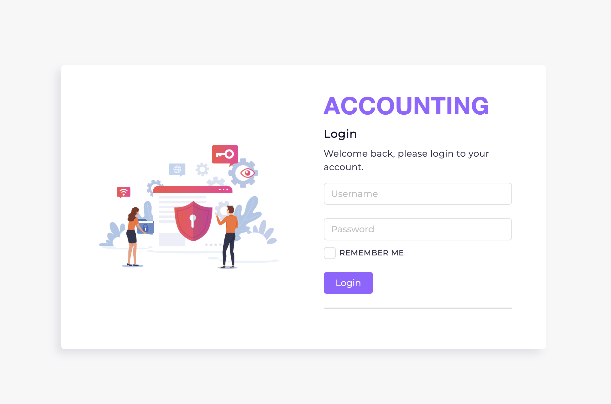
#### Main Page (Dashboard)
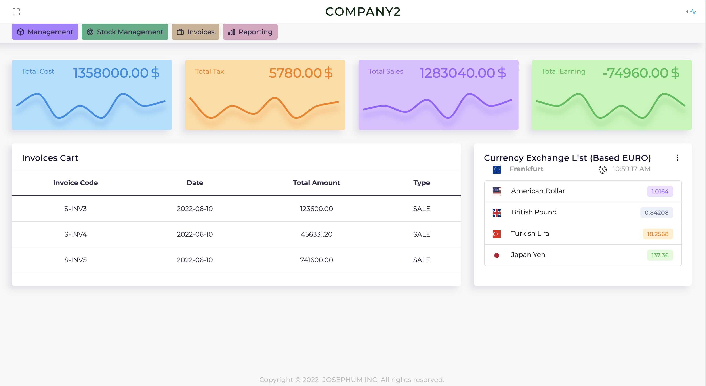
#### Company Registration
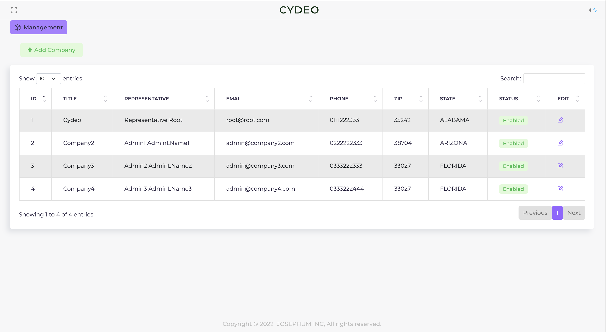
#### User Registration
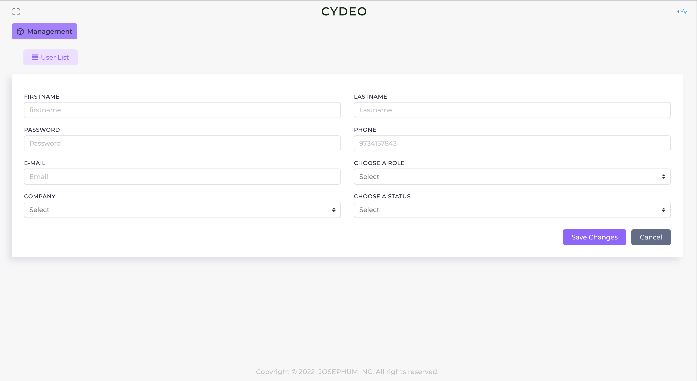
#### Client/Vendor Registration
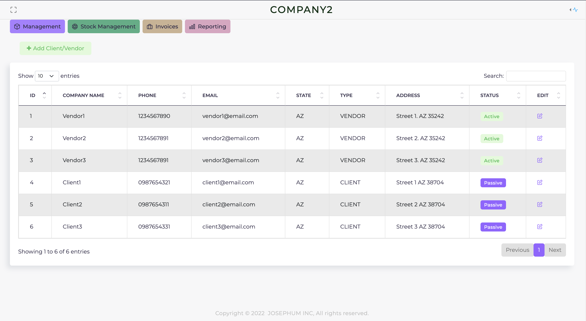
#### Stock Management Menu - Products
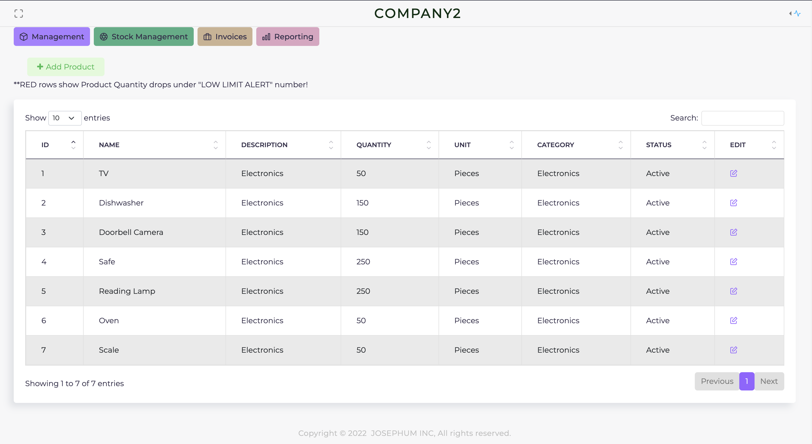
#### Stock Management Menu - Category
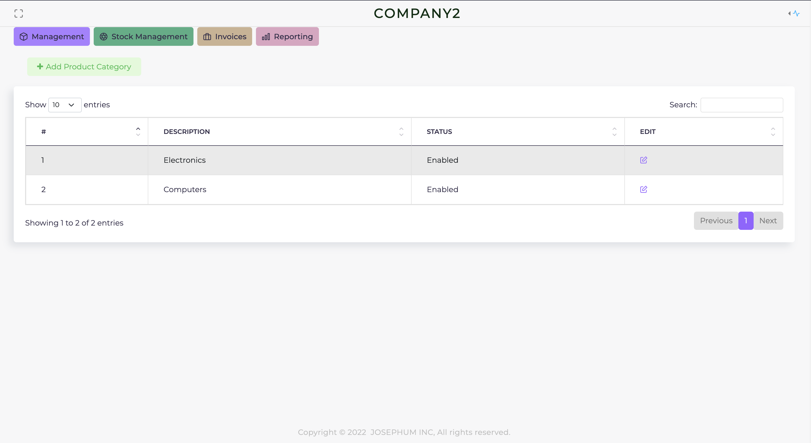
#### Invoices Menu - Purchase
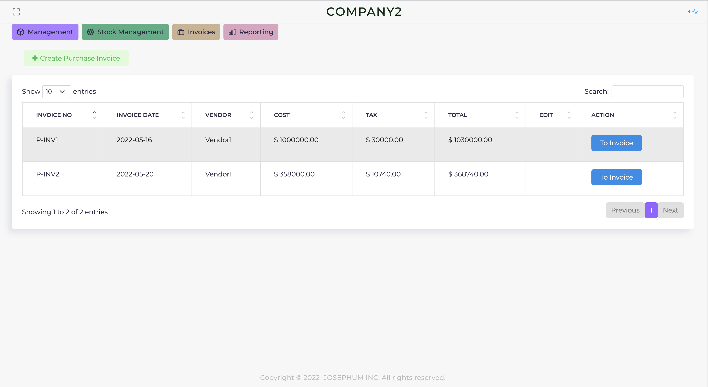
#### Invoices Menu- Sale
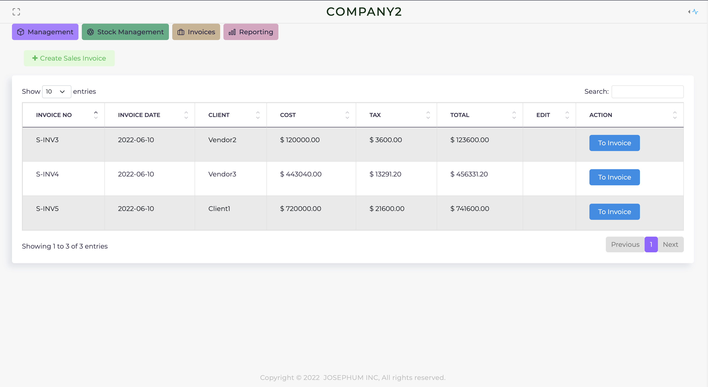
#### Reporting Menu - Stock Report
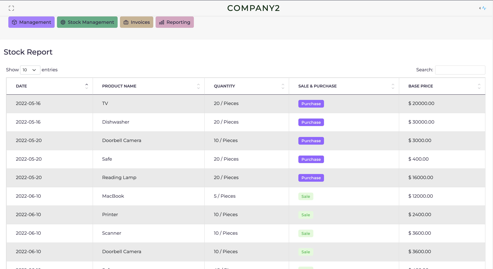
#### Reporting Menu - Profit/Loss
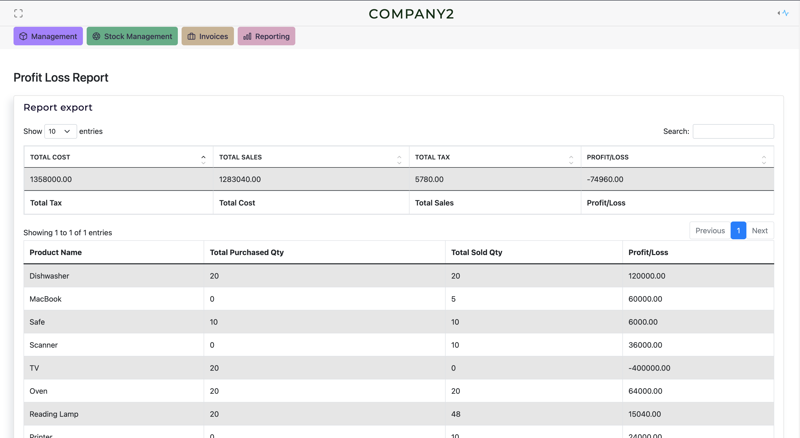